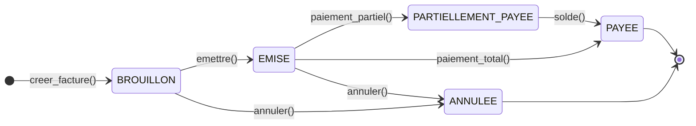
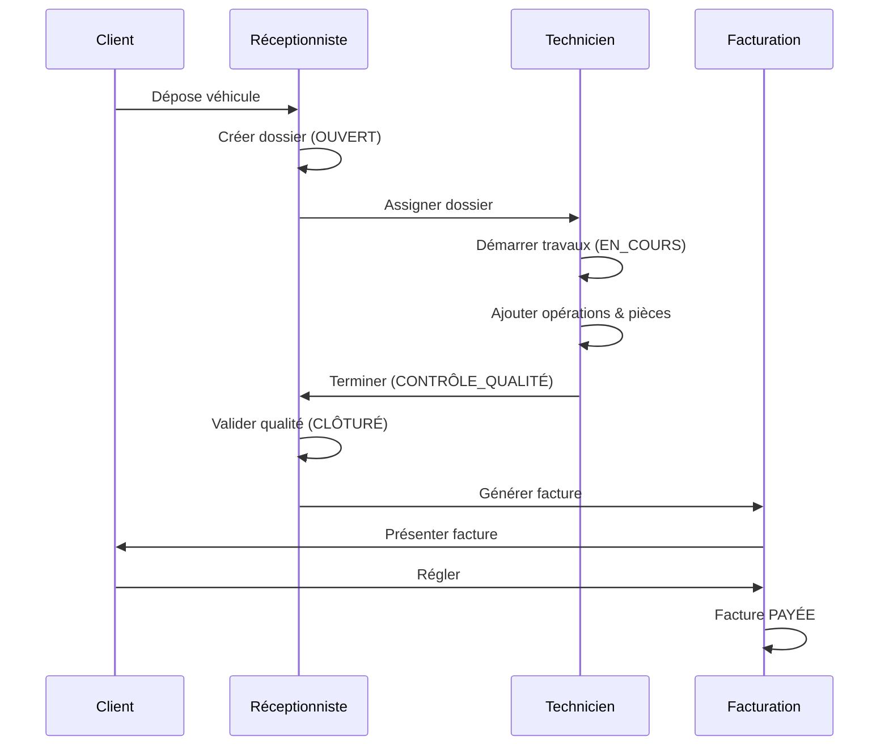

# Sprint 06 — Guide Utilisateur Intégré & Générateur de Documentation

**Statut :** Planifié
**Dépend de :** Sprint 05 (Report Designer, base fonctionnelle complète)

---

## Objectif

Fournir une documentation utilisateur **vivante et intégrée** directement dans l'application,
enrichie de diagrammes SVG/Mermaid, exportable en HTML et en PDF, et auto-générée à partir
du code source (permissions, états, workflows).

---

## Contexte

Les garages tunisiens n'ont pas de département IT. Le manuel d'utilisation doit être :
- **Accessible en un clic** depuis le menu Aide de l'application
- **Illustré** — les workflows (réparation, facturation, stock) sont complexes sans diagrammes
- **Multilingue** — en français et en arabe (Sprint 05 Feature 7)
- **Exportable** — imprimable ou envoyable par email

---

## Feature 1 — Guide Utilisateur intégré (in-app HTML viewer)

### Structure du guide

```
Guide/
├── 00_introduction.md       Présentation, rôles, navigation
├── 01_reception.md          Clients, Véhicules, Rendez-vous
├── 02_atelier.md            Dossiers de réparation, état machine
├── 03_stock.md              Catalogue pièces, Fournisseurs, Factures achat
├── 04_facturation.md        Factures, Caisse, Créances, Charges
├── 05_administration.md     Société, Utilisateurs, Numérotation, DB
├── 06_rapports.md           Tous les rapports disponibles
└── 07_faq.md                Questions fréquentes, résolution de problèmes
```

Chaque page est un fichier Markdown stocké dans `resources/guide/fr/` (et `ar/` pour l'arabe).
Le moteur lit le Markdown, insère les diagrammes SVG inline et affiche dans un `QTextBrowser`.

### Rendu

```
┌─────────────────────────────────────────────────────────────────┐
│  Guide Utilisateur                              [Imprimer] [PDF]  │
├──────────────────┬──────────────────────────────────────────────┤
│  SOMMAIRE        │  2. Gestion des dossiers de réparation       │
│  ─────────────── │  ────────────────────────────────────────    │
│  Introduction    │  Un dossier suit le cycle de vie suivant :   │
│  1. Réception    │                                              │
│  2. Atelier  ←   │  [Diagramme SVG état machine]               │
│  3. Stock        │                                              │
│  4. Facturation  │  ### Créer un dossier                        │
│  5. Admin        │  1. Cliquez sur **Dossiers** dans la sidebar │
│  6. Rapports     │  2. Bouton **+ Nouveau dossier**…            │
│  7. FAQ          │                                              │
│                  │  > **Conseil** : Saisissez le kilométrage…   │
└──────────────────┴──────────────────────────────────────────────┘
```

### `GuideWindow` (MDI sub-window)

```python
class GuideWindow(QMdiSubWindow):
    def __init__(self, ctx, session, page: str = "00_introduction") -> None: ...
    def _load_page(self, page: str) -> None:
        md_path = resource_path("resources", "guide", ctx.settings.language, f"{page}.md")
        html = MarkdownRenderer.render(md_path)   # inlines SVG, converts MD to HTML
        self._browser.setHtml(html)
```

---

## Feature 2 — Diagrammes SVG et Mermaid

### Approche

Deux types de diagrammes sont utilisés :

#### 2a. SVG statiques pré-générés

Les diagrammes d'état machine et de flux sont écrits en Mermaid Markdown dans les fichiers `.md`,
puis **pré-rendus en SVG** au moment du build et stockés dans `resources/guide/img/`.

Outils : `mmdc` (Mermaid CLI, Node.js) — appelé dans `build.ps1` pour régénérer les SVG si les
sources `.mmd` changent.

```bash
# build.ps1 — section guide
Get-ChildItem resources/guide/diagrams/*.mmd | ForEach-Object {
    mmdc -i $_.FullName -o "resources/guide/img/$($_.BaseName).svg"
}
```

#### 2b. Mermaid inline rendu côté client (HTML viewer)

Pour les pages exportées en HTML standalone, Mermaid.js est embarqué localement (bundle JS dans
`resources/guide/vendor/mermaid.min.js`) — pas de CDN, fonctionne hors ligne.

```html
<div class="mermaid">
stateDiagram-v2
    [*] --> OUVERT
    OUVERT --> EN_COURS : démarrer_travaux()
    EN_COURS --> EN_ATTENTE_PIECES : commander_pieces()
    EN_ATTENTE_PIECES --> EN_COURS : pieces_recues()
    EN_COURS --> CONTROLE_QUALITE : terminer_travaux()
    CONTROLE_QUALITE --> CLOTURE : valider_qualite()
    CLOTURE --> [*]
</div>
<script src="vendor/mermaid.min.js"></script>
<script>mermaid.initialize({startOnLoad:true});</script>
```

### Diagrammes à produire

| Fichier | Contenu |
|---|---|
| `dossier_state_machine.svg` | États du DossierRéparation (8 états) |
| `facture_lifecycle.svg` | Cycle de vie Facture (BROUILLON→PAYEE) |
| `stock_flux.svg` | Flux stock (entrer/sortir/commander) |
| `rbac_overview.svg` | Matrice rôles × permissions |
| `module_overview.svg` | Vue d'ensemble des modules (mind-map) |
| `dossier_to_facture.svg` | Séquence : dossier → devis → facture → paiement |
| `multi_dossier.svg` | Flux sélection dossier au démarrage |

### Sources Mermaid (à créer dans `resources/guide/diagrams/`)

**dossier_state_machine.mmd** :


**facture_lifecycle.mmd** :


**dossier_to_facture.mmd** :


---

## Feature 3 — Export HTML & PDF

### Export HTML standalone

Le guide complet est exporté en un seul fichier HTML autonome :
- CSS embarqué (pas de dépendances externes)
- Mermaid.js embarqué localement
- Toutes les images SVG inline (base64)
- Navigation par ancres `#section-id`

```python
class GuideExporter:
    def export_html(self, output_path: Path, locale: str = "fr") -> None:
        """Single-file HTML with all assets inlined."""

    def export_pdf(self, output_path: Path, locale: str = "fr") -> None:
        """PDF via QPrinter + QTextDocument."""
```

### GUI — boutons dans `GuideWindow`

| Bouton | Action |
|---|---|
| `Imprimer…` | `QPrintDialog` → `QTextDocument.print()` |
| `Exporter HTML` | `QFileDialog` → `GuideExporter.export_html()` |
| `Exporter PDF` | `QFileDialog` → `GuideExporter.export_pdf()` |

---

## Feature 4 — Auto-génération depuis le code

### Générateur de référence technique

Un sous-outil `tools/guide_generator/` génère automatiquement certaines sections à partir du
code source :

| Section auto-générée | Source |
|---|---|
| Matrice permissions | `domain/auth/permission.py` + `ROLE_PERMISSIONS` |
| État machine dossier | introspection des méthodes de `DossierReparation` |
| Liste des rapports disponibles | introspection de `main_window.py` openers |
| Raccourcis clavier | actions `QAction` avec `shortcut()` non vide |

```python
# tools/guide_generator/rbac_table.py
def generate_rbac_table() -> str:
    """Returns Markdown table of roles × permissions."""
    from garage_app.domain.auth.permission import ROLE_PERMISSIONS, Permission
    header = "| Permission | " + " | ".join(ROLE_PERMISSIONS.keys()) + " |"
    sep    = "|---|" + "---|" * len(ROLE_PERMISSIONS)
    rows = []
    for perm in Permission:
        row = f"| `{perm.value}` |"
        for perms in ROLE_PERMISSIONS.values():
            row += " ✓ |" if perm in perms else " — |"
        rows.append(row)
    return "\n".join([header, sep] + rows)
```

---

## Feature 5 — Aide contextuelle (tooltips enrichis)

Chaque fenêtre majeure peut afficher un bouton `?` qui ouvre le guide directement à la page
correspondante.

```python
# Dans chaque window (ex. DossierWindow) :
btn_help = QPushButton("?")
btn_help.setFixedSize(20, 20)
btn_help.setToolTip("Aide — Gestion des dossiers")
btn_help.clicked.connect(
    lambda: registry.open_or_activate(GuideWindow, ctx, session, page="02_atelier")
)
```

---

## Structure des fichiers Markdown (exemple `02_atelier.md`)

```markdown
# 2. Gestion de l'Atelier

## 2.1 Cycle de vie d'un dossier

Un dossier de réparation suit le cycle d'états suivant :


## 2.2 Créer un nouveau dossier

1. Dans la barre latérale, cliquez sur **Dossiers**
2. Cliquez sur le bouton **+ Nouveau dossier**
3. Sélectionnez le client et le véhicule
4. Saisissez le kilométrage à l'entrée
5. Cliquez sur **Enregistrer**

> **Conseil** : Si le client n'existe pas, créez-le d'abord depuis
> **Réception → Clients**.

## 2.3 Transitions d'état

| Action | État actuel | Nouvel état | Qui peut faire ? |
|---|---|---|---|
| Démarrer travaux | OUVERT | EN_COURS | Technicien, Admin |
| Commander pièces | EN_COURS | EN_ATTENTE_PIÈCES | Technicien |
| Terminer | EN_COURS | CONTRÔLE_QUALITÉ | Technicien |
| Valider qualité | CONTRÔLE_QUALITÉ | CLÔTURÉ | Admin, Superadmin |
```

---

## Ordre d'implémentation recommandé

```
1. Contenu Markdown                (rédaction des 7 fichiers .md — fr)
   └── resources/guide/fr/*.md

2. Sources Mermaid                 (7 fichiers .mmd)
   └── resources/guide/diagrams/*.mmd
   └── Pré-rendu SVG via mmdc (ou fallback SVG statiques)

3. MarkdownRenderer                (tools/guide_generator/md_renderer.py)
   └── Convertit MD → HTML (stdlib re, pas de dépendance externe)
   └── Inline SVG depuis resources/guide/img/
   └── Applique CSS propre au guide

4. GuideWindow                     (gui/help/guide_window.py)
   └── QSplitter : sommaire | contenu
   └── Boutons Imprimer / Export HTML / Export PDF

5. GuideExporter                   (tools/guide_generator/guide_exporter.py)
   └── HTML autonome (inline tout)
   └── PDF via QPrinter

6. Auto-génération                 (tools/guide_generator/rbac_table.py, shortcuts_table.py)
   └── Injecté dans le Markdown au build-time ou à la volée

7. Aide contextuelle               (bouton ? dans chaque MDI window)
   └── Wiring page par window

8. Traduction arabe                (resources/guide/ar/*.md)
   └── Après Feature 7 du Sprint 05 (locale AR)
```

---

## Dépendances / Risques

| Risque | Mitigation |
|---|---|
| `mmdc` (Node.js) pas installé chez le client | Les SVG sont pré-générés au build-time et livrés dans le bundle — pas besoin de Node.js en runtime |
| `QTextBrowser` ne supporte pas Mermaid JS | Utiliser des SVG statiques dans le viewer PyQt ; Mermaid JS uniquement dans l'export HTML externe |
| Markdown complexe (tableaux, images) mal rendu | Bibliothèque `mistune` (pure Python, légère) ou rendu maison limité aux constructions utilisées |
| Volume de rédaction | Commencer par les 3 modules les plus utilisés (Atelier, Facturation, Stock) ; FAQ auto-générée |
| Maintenance du guide lors des mises à jour | Les sections auto-générées (permissions, raccourcis) se mettent à jour automatiquement ; rest manuel |

---

## Exemple de diagramme SVG embarqué (module_overview.svg)

```
                    ┌──────────────────────────────────┐
                    │   Gestion Réparation Voiture      │
                    │      Alfa Computers Apps          │
                    └─────────────┬────────────────────┘
           ┌─────────────┬────────┴──────┬──────────────┐
           ▼             ▼               ▼               ▼
      ┌─────────┐  ┌──────────┐  ┌───────────┐  ┌────────────┐
      │Réception│  │  Atelier │  │   Stock   │  │Facturation │
      │Clients  │  │Dossiers  │  │Catalogue  │  │Factures    │
      │Véhicules│  │BT Rapide │  │Fourniss.  │  │Caisse      │
      │Rdv      │  │          │  │Fact.Achat │  │Charges     │
      └─────────┘  └──────────┘  └───────────┘  └────────────┘
                                                       │
                    ┌──────────────────────────────────┘
                    ▼
              ┌──────────────┐
              │ Administration│
              │Société/Users  │
              │Numérotation   │
              │Multi-Dossier  │
              └──────────────┘
```
